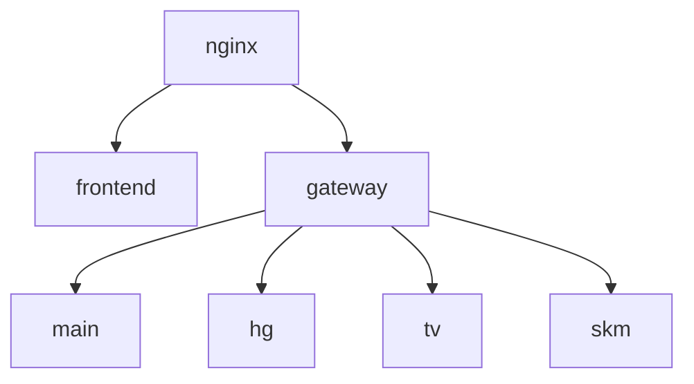

# dev_main
공통

- [테스트 서버](http://aiedu.tplinkdns.com/)

- 시스템 구조

---

## **4월 넷째주 일정**
| 날짜 | 오전 | 오후 | 특이사항 |
| :--- | :--- | :--- | :--- |
| 4/20(월) | 삼정KPMG 특강 | 공통부문 회의 | - |
| 4/21(화) | 공통부문 회의 | 공통부문 회의 | - |
| 4/22(수) | 삼정KPMG 특강 | 공통부문 회의 | - |
| 4/23(목) | 공통부문 회의 및 개발 | 개발 | - |
| 4/24(금) | 공통부문 회의 및 팀 회의 | 멘토링 | - |

---

## **4월 다섯째주/5월 첫째주 일정**
| 날짜 | 오전 | 오후 | 특이사항 |
| :--- | :--- | :--- | :--- |
| 4/27(월) | 공통부문 회의 및 개발 | 삼정KPMG 특강 | - |
| 4/28(화) | 공통부문 회의 및 개발 | 개발 | - |
| 4/29(수) | 개발 | 개발 | - |
| 4/30(목) | 삼정KPMG 특강 예정 | 코드 리뷰 예정 | - |
| 5/01(금) | - | - | 휴일 |

---

## **5월 둘째주 일정**
| 날짜 | 오전 | 오후 | 특이사항 |
| :--- | :--- | :--- | :--- |
| 5/04(월) | 삼정KPMG 강의 예정 | 개발 | - |
| 5/05(화) | - | - | 휴일 |
| 5/06(수) | 삼정KPMG 강의 예정 | 개발 | - |
| 5/07(목) | 공통 부문 최종 테스트 | 개발 | - |
| 5/08(금) | 멘토링 예정 | 개발 | - |

---

## **5월 셋째주 일정**
| 날짜 | 오전 | 오후 | 특이사항 |
| :--- | :--- | :--- | :--- |
| 5/11(월) | 삼정KPMG 강의 예정 | - | - |
| 5/12(화) | - | - | - |
| 5/13(수) | 삼정KPMG 강의 예정 | - | - |
| 5/14(목) | 취업 특강 | - | 이력서 작성 요령 및 양식 제공 |
| 5/15(금) | 멘토링 예정 | 개발 | - |

---

## **5월 넷째주 일정**
| 날짜 | 오전 | 오후 | 특이사항 |
| :--- | :--- | :--- | :--- |
| 5/18(월) | 삼정KPMG 강의 예정 | - | - |
| 5/19(화) | - | - | - |
| 5/20(수) | 삼정KPMG 강의 예정 | - | - |
| 5/21(목) | - | - | - |
| 5/22(금) | 멘토링 예정 | 개발 | 이력서 제출 마감일 |

---

## **5월 다섯째주 일정**
| 날짜 | 오전 | 오후 | 특이사항 |
| :--- | :--- | :--- | :--- |
| 5/25(월) | - | - | - |
| 5/26(화) | 4명씩 개인면담 | - | 4층 실장님과 이력서 피드백 |
| 5/27(수) | 4명씩 개인면담 | - | 4층 실장님과 이력서 피드백 |
| 5/27(목) | 4명씩 개인면담 | - | 4층 실장님과 이력서 피드백 |
| 5/29(금) | 멘토링 예정 | 개발 | - |

---

## **6월 첫째주 일정**
| 날짜 | 오전 | 오후 | 특이사항 |
| :--- | :--- | :--- | :--- |
| 6/01(월) | - | - | - |
| 6/02(화) | - | - | - |
| 6/03(수) | - | - | - |
| 6/04(목) | - | - | - |
| 6/05(금) | - | - | - |

---

## **6월 둘째주 일정**
| 날짜 | 오전 | 오후 | 특이사항 |
| :--- | :--- | :--- | :--- |
| 6/08(월) | - | - | - |
| 6/09(화) | - | - | - |
| 6/10(수) | - | - | - |
| 6/11(목) | - | - | - |
| 6/12(금) | - | - | - |

---

## **6월 셋째주 일정**
| 날짜 | 오전 | 오후 | 특이사항 |
| :--- | :--- | :--- | :--- |
| 6/15(월) | - | - | - |
| 6/16(화) | - | - | - |
| 6/17(수) | - | - | - |
| 6/18(목) | - | - | - |
| 6/19(금) | 최종 테스트 완료 | 발표 자료 제출일 | - |

---

## **6월 넷째주 일정**
| 날짜 | 오전 | 오후 | 특이사항 |
| :--- | :--- | :--- | :--- |
| 6/22(월) | - | - | - |
| 6/23(화) | - | - | - |
| 6/24(수) | - | - | - |
| 6/25(목) | - | - | 종강 |

