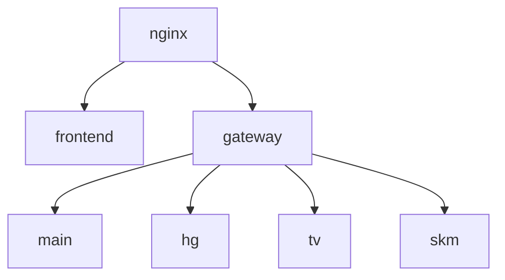

# 공통 플랫폼 프론트엔드 API 연동 표준 가이드

> 대상: 공통 플랫폼 프론트 팀, 백엔드 API 연동 담당자, 신규 화면 구현 담당자  
> 기준 코드: `App.jsx`, `network.js`, `AuthContext.jsx`, `AlarmContext.jsx`, `CompanySelect.jsx`, `HeaderNav.jsx`, `SidebarNav.jsx`, `Alarm.jsx`, `Onboarding.jsx`, `Login.jsx`  
> 기준 아키텍처: `nginx → frontend`, `nginx → gateway`, `gateway → main/hg/tv/skm`  
> 전제: `main`은 공통 플랫폼 API, `skm`은 SR 자동화 보고서 서비스 API, `hg/tv`는 타 서비스 API이다.

---

## 0. 결론 요약

현재 프론트 구조는 API 실연동 직전 단계로 볼 수 있다. 화면 구성과 더미 상태 흐름은 어느 정도 구현되어 있으나, 백엔드 연결 전에 반드시 공통화해야 하는 축이 있다.

우선순위는 아래 순서가 맞다.

1. `network.js`를 모든 API 인스턴스의 공통 진입점으로 고정한다.
2. `AuthContext.jsx`를 로그인 상태, 선택 회사, 권한 스코프의 단일 기준으로 만든다.
3. `AlarmContext.jsx`는 알림 UI 상태와 알림 데이터 상태를 분리해서 관리한다.
4. `App.jsx`는 로그인 전/후 레이아웃 분기와 인증 페이지 보호 기준을 제공한다.
5. 각 페이지는 직접 `localStorage`, `fetch`, 더미 API를 만지지 않고 도메인 API 모듈만 호출한다.
6. `Onboarding.jsx`는 `metricId`, `issueGroupCode`, `status`, `assignees`, `evidence` 중심으로 백엔드와 연결한다.

가장 중요한 원칙은 다음이다.

```txt
페이지 컴포넌트는 UI와 이벤트만 담당한다.
API 주소, 인증 헤더, uuid 갱신, company_id 주입, 에러 공통 처리는 network/api/context 계층에서 담당한다.
```

---

## 1. 전체 시스템 흐름 이해

현재 README의 시스템 구조는 다음과 같다.



해석은 다음과 같다.

| 구성 | 역할 | 프론트 연결 기준 |
|---|---|---|
| `frontend` | React/Vite 프론트 | 화면 렌더링, Context 상태 관리, API 호출 |
| `gateway` | API 라우팅 계층 | main/hg/tv/skm 서비스로 요청 분기 |
| `main` | 공통 플랫폼 API | 로그인, 회원가입, 회사선택, 사용자, 권한, 알림, 온보딩 공통 |
| `skm` | SR 자동화 보고서 API | 보고서 자동화, SR 생성, 보고서 관련 데이터 처리 |
| `hg`, `tv` | 다른 팀 서비스 API | 각 팀별 서비스 화면/기능 |

따라서 `network.js`에 API 인스턴스가 여러 개 있는 것은 가능하다. 다만 이름은 서비스 의미가 드러나게 잡는 편이 좋다.

현재:

```js
export const api = axios.create({ baseURL: import.meta.env.VITE_API_URL })
export const skmApi = axios.create({ baseURL: import.meta.env.VITE_API_URL_SKM })
export const hgApi = axios.create({ baseURL: import.meta.env.VITE_API_URL_HG })
export const tvApi = axios.create({ baseURL: import.meta.env.VITE_API_URL_TV })
```

권장:

```js
export const mainApi = createApiClient(import.meta.env.VITE_API_URL_MAIN);
export const srApi = createApiClient(import.meta.env.VITE_API_URL_SKM); // SR 자동화 보고서 서비스
export const hgApi = createApiClient(import.meta.env.VITE_API_URL_HG);
export const tvApi = createApiClient(import.meta.env.VITE_API_URL_TV);
```

`skmApi`라는 이름을 유지해도 되지만, 주석으로 반드시 다음 의미를 남기는 것을 권장한다.

```js
// skmApi = SR 자동화 보고서 서비스 API. 회사별 API가 아니라 서비스별 API이다.
```

---

## 2. 백엔드와 어디를 어떻게 연결할지

### 2.1 공통 API 연결 범위

공통 플랫폼 프론트에서 백엔드와 연결해야 하는 API 범위는 다음이다.

| 화면/기능 | 연결 API | 담당 백엔드 | 프론트 파일 |
|---|---|---|---|
| 로그인 | `POST /auth/login` | main | `Login.jsx`, `AuthContext.jsx` |
| 내 정보 복원 | `GET /auth/me` | main | `AuthContext.jsx` |
| 로그아웃 | `POST /auth/logout` | main | `AuthContext.jsx`, `HeaderNav.jsx` |
| 회사 목록 조회 | `GET /companies` 또는 로그인 응답 포함 | main | `AuthContext.jsx`, `CompanySelect.jsx`, `SidebarNav.jsx` |
| 회사 선택 | `POST /auth/select-company` 또는 프론트 상태 반영 | main | `CompanySelect.jsx`, `AuthContext.jsx` |
| 알림 목록 | `GET /notifications` | main | `AlarmContext.jsx`, `Alarm.jsx` |
| 알림 읽음 처리 | `PATCH /notifications/read` | main | `AlarmContext.jsx`, `Alarm.jsx` |
| 알림 삭제 | `DELETE /notifications/{notificationId}` | main | `AlarmContext.jsx`, `Alarm.jsx` |
| 실시간 알림 | `SSE /notifications/stream` 또는 WebSocket/STOMP | main | `AlarmContext.jsx` |
| 온보딩 지표 조회 | `GET /onboarding/metrics` | main 또는 skm 협의 | `Onboarding.jsx` → `onboarding.api.js` |
| 온보딩 임시저장 | `POST /onboarding/metrics/{metricId}/draft` | main | `Onboarding.jsx` → `onboarding.api.js` |
| 온보딩 제출 | `POST /onboarding/metrics/{metricId}/submit` | main | `Onboarding.jsx` → `onboarding.api.js` |
| 온보딩 승인 | `POST /onboarding/metrics/{metricId}/approve` | main | `Onboarding.jsx` → `onboarding.api.js` |
| 온보딩 반려 | `POST /onboarding/metrics/{metricId}/reject` | main | `Onboarding.jsx` → `onboarding.api.js` |
| 증빙 업로드 | `POST /onboarding/metrics/{metricId}/evidence` 또는 presigned URL 방식 | main/skm 협의 | `Onboarding.jsx` → `onboarding.api.js` |
| 담당자 초대 | `POST /issue-groups/{issueGroupCode}/assignees/invite` | main | `Onboarding.jsx` → `onboarding.api.js` |
| 담당자 해제 | `DELETE /issue-groups/{issueGroupCode}/assignees/{userId}` | main | `Onboarding.jsx` → `onboarding.api.js` |
| SR 자동화 보고서 | `/skm/...` 또는 `/sr/...` | skm | 향후 SR 화면 |

---

## 3. API 응답 표준

백엔드와 프론트가 맞춰야 할 공통 응답 형식은 하나로 고정하는 게 좋다.

```json
{
  "status": "success",
  "message": null,
  "data": {},
  "meta": {
    "requestId": "uuid",
    "nextUuid": "rotated-session-uuid"
  }
}
```

에러 응답은 아래처럼 통일한다.

```json
{
  "status": "error",
  "message": "권한이 없습니다.",
  "error": {
    "code": "FORBIDDEN",
    "detail": "해당 issue_group에 대한 review 권한이 없습니다."
  },
  "meta": {
    "requestId": "uuid"
  }
}
```

프론트에서 직접 `res.data.data`, `res.data.status`를 매번 확인하지 않도록 `network.js`의 response interceptor 또는 API 모듈에서 표준화한다.

---

## 4. `network.js` 연결 설계

### 4.1 현재 코드 역할

현재 `network.js`는 다음을 한다.

1. `api`, `skmApi`, `hgApi`, `tvApi` axios 인스턴스를 생성한다.
2. `applyAuthInterceptor(instance)`로 모든 인스턴스에 요청 인터셉터를 붙인다.
3. 요청 시 `localStorage.uuid`를 `Authorization: Bearer {uuid}`로 넣는다.
4. `localStorage.selectedCompany.company_id`를 `X-Company-ID` 헤더로 넣는다.

현재 구조는 실연동의 기본 방향으로는 맞다. 다만 실서비스 연결 전 아래가 필요하다.

- response interceptor 추가
- 새 uuid 수신 시 localStorage/AuthContext 동기화
- JSON parse 실패 방어
- 401/403/500 공통 처리
- requestId 자동 생성
- 서비스별 API 이름 명확화

### 4.2 권장 `network.js`

```js
// src/utils/network.js
import axios from "axios";
import { authStorage } from "./authStorage";

const createApiClient = (baseURL) => {
  const instance = axios.create({
    baseURL,
    headers: {
      "Content-Type": "application/json",
    },
  });

  instance.interceptors.request.use((config) => {
    const uuid = authStorage.getUuid();
    const selectedCompany = authStorage.getSelectedCompany();

    config.headers["X-Request-ID"] = crypto.randomUUID();

    if (uuid) {
      config.headers.Authorization = `Bearer ${uuid}`;
    }

    if (selectedCompany?.company_id) {
      config.headers["X-Company-ID"] = selectedCompany.company_id;
    }

    return config;
  });

  instance.interceptors.response.use(
    (response) => {
      const nextUuid =
        response.headers["x-next-uuid"] ||
        response.data?.meta?.nextUuid;

      if (nextUuid) {
        authStorage.setUuid(nextUuid);
        window.dispatchEvent(new CustomEvent("auth:uuid-rotated", { detail: { uuid: nextUuid } }));
      }

      return response.data;
    },
    (error) => {
      const status = error.response?.status;

      if (status === 401) {
        window.dispatchEvent(new CustomEvent("auth:unauthorized"));
      }

      if (status === 403) {
        window.dispatchEvent(new CustomEvent("auth:forbidden", {
          detail: error.response?.data,
        }));
      }

      return Promise.reject(error.response?.data || error);
    }
  );

  return instance;
};

export const mainApi = createApiClient(import.meta.env.VITE_API_URL_MAIN || import.meta.env.VITE_API_URL);
export const skmApi = createApiClient(import.meta.env.VITE_API_URL_SKM);
export const hgApi = createApiClient(import.meta.env.VITE_API_URL_HG);
export const tvApi = createApiClient(import.meta.env.VITE_API_URL_TV);

// 기존 코드 호환용. 새 코드에서는 mainApi 사용 권장.
export const api = mainApi;
```

### 4.3 `authStorage.js` 분리 권장

`network.js`가 직접 `localStorage` 구조를 알면 유지보수가 어려워진다. 저장소 접근은 별도 파일로 분리한다.

```js
// src/utils/authStorage.js
const UUID_KEY = "uuid";
const NAME_KEY = "name";
const COMPANIES_KEY = "companies";
const SELECTED_COMPANY_KEY = "selectedCompany";

const safeParse = (value, fallback = null) => {
  try {
    return value ? JSON.parse(value) : fallback;
  } catch {
    return fallback;
  }
};

export const authStorage = {
  getUuid() {
    return localStorage.getItem(UUID_KEY);
  },
  setUuid(uuid) {
    localStorage.setItem(UUID_KEY, uuid);
  },
  getName() {
    return localStorage.getItem(NAME_KEY);
  },
  setName(name) {
    localStorage.setItem(NAME_KEY, name);
  },
  getCompanies() {
    return safeParse(localStorage.getItem(COMPANIES_KEY), []);
  },
  setCompanies(companies) {
    localStorage.setItem(COMPANIES_KEY, JSON.stringify(companies || []));
  },
  getSelectedCompany() {
    return safeParse(localStorage.getItem(SELECTED_COMPANY_KEY), null);
  },
  setSelectedCompany(company) {
    localStorage.setItem(SELECTED_COMPANY_KEY, JSON.stringify(company));
  },
  clear() {
    localStorage.removeItem(UUID_KEY);
    localStorage.removeItem(NAME_KEY);
    localStorage.removeItem(COMPANIES_KEY);
    localStorage.removeItem(SELECTED_COMPANY_KEY);
  },
};
```

---

## 5. 인증/세션 흐름

### 5.1 사용자가 설명한 세션 구조 반영

현재 프로젝트에서는 다음 구조를 전제로 한다.

```txt
로그인 성공
→ 백엔드가 uuid, company list, user info 반환
→ 프론트는 uuid, selectedCompany, user info를 localStorage/AuthContext에 저장
→ API 요청 시 uuid/company_id를 헤더로 전송
→ 백엔드는 Redis에서 uuid로 accessToken 조회
→ accessToken/uuid는 5분 단위로 교체 가능
→ 응답에 nextUuid가 오면 프론트가 localStorage와 AuthContext를 갱신
```

### 5.2 백엔드 로그인 응답 권장 형태

```json
{
  "status": "success",
  "data": {
    "uuid": "session-public-uuid",
    "user": {
      "user_id": "u_001",
      "name": "홍길동",
      "email": "hong@company.com",
      "role_code": "ADMIN"
    },
    "companies": [
      {
        "company_id": "c_001",
        "company_name": "SKM",
        "role_code": "ADMIN",
        "issue_group_scopes": [
          { "issue_group_code": "CLIMATE", "actions": ["input", "review", "final_approve"] }
        ]
      }
    ]
  },
  "message": null
}
```

현재 `AuthContext.jsx`는 `data.companys`를 사용한다. 오타 가능성이 있으므로 백엔드와 `companies`로 맞추는 것을 권장한다. 기존 호환이 필요하면 프론트에서 둘 다 처리한다.

```js
const companies = data.companies || data.companys || [];
```

---

## 6. `AuthContext.jsx` 관리 방식

### 6.1 현재 코드 역할

현재 `AuthContext.jsx`는 다음 상태를 가진다.

| 상태 | 현재 의미 |
|---|---|
| `user` | 로그인 사용자. 현재는 `{ uuid, name }` 수준 |
| `companies` | 로그인 사용자가 접근 가능한 회사 목록 |
| `selectedCompany` | 현재 선택한 회사 |

현재 함수는 다음과 같다.

| 함수 | 현재 역할 | 실연동 시 보완 |
|---|---|---|
| `login(data)` | 로그인 응답을 상태/localStorage에 저장 | `companies/companys` 정규화, role/scope 저장, 회사 1개면 자동 선택 |
| `selectCompany(companyId)` | 회사 목록에서 선택 회사 저장 | 백엔드 회사 선택 API 호출 여부 결정 |
| `logout()` | 상태와 localStorage 삭제 | `POST /auth/logout` 호출 후 삭제 |
| `useEffect()` | 앱 로드 시 localStorage 복원 | 가능하면 `GET /auth/me`로 서버 검증 추가 |

### 6.2 권장 AuthContext 형태

```js
// src/hooks/AuthContext.jsx
import { createContext, useContext, useEffect, useMemo, useState } from "react";
import { mainApi } from "@utils/network";
import { authStorage } from "@utils/authStorage";

const AuthContext = createContext(null);

export const AuthProvider = ({ children }) => {
  const [user, setUser] = useState(null);
  const [companies, setCompanies] = useState([]);
  const [selectedCompany, setSelectedCompany] = useState(null);
  const [isAuthReady, setIsAuthReady] = useState(false);

  useEffect(() => {
    const restore = async () => {
      const uuid = authStorage.getUuid();
      const storedCompanies = authStorage.getCompanies();
      const storedCompany = authStorage.getSelectedCompany();
      const name = authStorage.getName();

      if (!uuid) {
        setIsAuthReady(true);
        return;
      }

      // 1차 복원: 새로고침 즉시 UI 유지
      setUser({ uuid, name });
      setCompanies(storedCompanies);
      setSelectedCompany(storedCompany);

      // 2차 검증: 백엔드 세션이 아직 유효한지 확인
      try {
        const res = await mainApi.get("/auth/me");
        hydrateAuth(res.data);
      } catch {
        clearAuth();
      } finally {
        setIsAuthReady(true);
      }
    };

    restore();

    const onUnauthorized = () => clearAuth();
    const onUuidRotated = (event) => {
      setUser((prev) => prev ? { ...prev, uuid: event.detail.uuid } : prev);
    };

    window.addEventListener("auth:unauthorized", onUnauthorized);
    window.addEventListener("auth:uuid-rotated", onUuidRotated);

    return () => {
      window.removeEventListener("auth:unauthorized", onUnauthorized);
      window.removeEventListener("auth:uuid-rotated", onUuidRotated);
    };
  }, []);

  const hydrateAuth = (payload) => {
    const uuid = payload.uuid;
    const user = payload.user;
    const companies = payload.companies || payload.companys || [];
    const initialCompany =
      payload.selectedCompany ||
      authStorage.getSelectedCompany() ||
      (companies.length === 1 ? companies[0] : null);

    setUser({ ...user, uuid });
    setCompanies(companies);
    setSelectedCompany(initialCompany);

    authStorage.setUuid(uuid);
    authStorage.setName(user?.name || "");
    authStorage.setCompanies(companies);
    if (initialCompany) authStorage.setSelectedCompany(initialCompany);
  };

  const login = async ({ loginId, password }) => {
    const res = await mainApi.post("/auth/login", { loginId, password });
    hydrateAuth(res.data);
    return res.data;
  };

  const selectCompany = async (companyId) => {
    const company = companies.find((c) => c.company_id === companyId);
    if (!company) return null;

    // 백엔드가 현재 회사 선택을 세션에 저장해야 한다면 호출
    // await mainApi.post("/auth/select-company", { company_id: companyId });

    setSelectedCompany(company);
    authStorage.setSelectedCompany(company);
    return company;
  };

  const clearAuth = () => {
    setUser(null);
    setCompanies([]);
    setSelectedCompany(null);
    authStorage.clear();
  };

  const logout = async () => {
    try {
      await mainApi.post("/auth/logout");
    } finally {
      clearAuth();
    }
  };

  const hasRole = (...roles) => {
    const role = selectedCompany?.role_code || user?.role_code;
    return roles.includes(role);
  };

  const canAccessIssueGroup = (issueGroupCode, actionType = "input") => {
    const role = selectedCompany?.role_code || user?.role_code;
    if (["SUPER", "ADMIN"].includes(role)) return true;

    const scopes = selectedCompany?.issue_group_scopes || [];
    return scopes.some((scope) =>
      scope.issue_group_code === issueGroupCode &&
      scope.actions?.includes(actionType)
    );
  };

  const value = useMemo(() => ({
    user,
    companies,
    selectedCompany,
    isAuthenticated: !!user,
    isAuthReady,
    login,
    logout,
    selectCompany,
    hasRole,
    canAccessIssueGroup,
  }), [user, companies, selectedCompany, isAuthReady]);

  return <AuthContext.Provider value={value}>{children}</AuthContext.Provider>;
};

export const useAuth = () => {
  const context = useContext(AuthContext);
  if (!context) throw new Error("useAuth는 AuthProvider 내부에서만 사용할 수 있습니다.");
  return context;
};
```

### 6.3 AuthContext가 제공해야 하는 최종 값

신규 페이지를 만드는 팀원은 아래 값만 사용하면 된다.

```js
const {
  user,
  companies,
  selectedCompany,
  isAuthenticated,
  isAuthReady,
  login,
  logout,
  selectCompany,
  hasRole,
  canAccessIssueGroup,
} = useAuth();
```

페이지에서 직접 `localStorage.getItem("uuid")`를 호출하지 않는다.  
페이지에서 직접 `selectedCompany`를 파싱하지 않는다.  
권한 판단은 `hasRole`, `canAccessIssueGroup`만 사용한다.

---

## 7. `AlarmContext.jsx` 관리 방식

### 7.1 현재 코드 역할

현재 `AlarmContext.jsx`는 다음을 담당한다.

| 상태/함수 | 현재 역할 |
|---|---|
| `isAlarmOpen` | 알림 사이드바 열림/닫힘 상태 |
| `notifications` | 더미 알림 목록 |
| `toggleAlarm()` | 알림창 열림/닫힘 토글 |
| `closeAlarm()` | 알림창 닫기 |
| `addNotification(text, type, title, chip)` | 프론트 로컬 알림 추가 |
| `removeNoti(id)` | 알림 삭제 |
| `markAllAsRead(types)` | 타입 기준 읽음 처리 |
| `clearAll()` | 알림 전체 삭제 |

현재 주석상 REST 조회와 STOMP/SSE 연결 지점은 이미 표시되어 있다. 실연동 시 이 주석을 실제 API 모듈 호출로 교체하면 된다.

### 7.2 알림 객체 표준

현재 알림 객체는 `id`, `type`, `title`, `chip`, `text`, `time`, `isRead`를 쓴다. 백엔드와는 아래 구조로 맞추는 것이 좋다.

```json
{
  "notification_id": "noti_001",
  "type": "USER",
  "title": "담당자 초대 수락",
  "message": "이수진 담당자님께서 초대를 수락했습니다.",
  "chip": {
    "text": "CLIMATE",
    "color_id": "E"
  },
  "target_path": "/main/onboarding?issue_group=CLIMATE",
  "target_resource_type": "issue_group",
  "target_resource_id": "CLIMATE",
  "is_read": false,
  "created_at": "2026-05-02T13:00:00Z"
}
```

프론트 내부에서는 기존 UI와 맞추기 위해 mapper를 둔다.

```js
// src/api/notification.mapper.js
export const mapNotificationFromApi = (item) => ({
  id: item.notification_id,
  type: item.type,
  title: item.title,
  text: item.message,
  chip: item.chip
    ? { text: item.chip.text, colorId: item.chip.color_id }
    : null,
  path: item.target_path,
  resourceType: item.target_resource_type,
  resourceId: item.target_resource_id,
  isRead: item.is_read,
  time: item.created_at,
});
```

### 7.3 권장 notification API 모듈

```js
// src/api/notification.api.js
import { mainApi } from "@utils/network";
import { mapNotificationFromApi } from "./notification.mapper";

export const notificationApi = {
  async list() {
    const res = await mainApi.get("/notifications");
    return (res.data || []).map(mapNotificationFromApi);
  },

  async markAllAsRead(types = null) {
    return mainApi.patch("/notifications/read", { types });
  },

  async remove(notificationId) {
    return mainApi.delete(`/notifications/${notificationId}`);
  },

  async clearAll() {
    return mainApi.delete("/notifications");
  },
};
```

### 7.4 권장 AlarmContext 흐름

```js
useEffect(() => {
  if (!user || !selectedCompany) return;

  const fetchNotifications = async () => {
    const list = await notificationApi.list();
    setNotifications(list);
  };

  fetchNotifications();
}, [user, selectedCompany]);
```

실시간 알림은 SSE가 단순하다.

```js
useEffect(() => {
  if (!user || !selectedCompany) return;

  const stream = new EventSource(
    `${import.meta.env.VITE_API_URL_MAIN}/notifications/stream?company_id=${selectedCompany.company_id}`
  );

  stream.onmessage = (event) => {
    const payload = JSON.parse(event.data);
    setNotifications((prev) => [mapNotificationFromApi(payload), ...prev]);
  };

  return () => stream.close();
}, [user, selectedCompany]);
```

단, uuid를 헤더로 보내야 한다면 EventSource 기본 API는 헤더 설정이 어렵다. 이 경우 WebSocket/STOMP를 쓰거나, 쿠키 기반 인증으로 바꾸는 편이 낫다.

---

## 8. `App.jsx` 라우팅/레이아웃 관리

### 8.1 현재 코드 역할

현재 `App.jsx`는 다음 구조다.

- `paths1`: `/`, `/login`, `/signup`, `/company`, `*`
- `paths2`: `/main`, `/main/dashboard`, `/main/onboarding`, `/main/Invite`, `main/*`
- `location.pathname.includes("/main")` 결과로 네비게이션 레이아웃 표시 여부 결정
- `/main` 영역에서 `AlarmProvider`, `Headernav`, `Sidebarnav`, `Alarm`을 렌더링

이 구조는 화면을 나누는 데는 동작하지만, 인증 보호 기준은 없다. 즉, 사용자가 URL로 `/main`에 직접 접근해도 진입 가능하다.

### 8.2 권장 구조

팀에서 `ProtectedRoute`, `PublicRoute`, `MainLayout`, `AuthLayout`을 아직 논의하지 않았다면 이름만 도입하지 않아도 된다. 그러나 같은 역할을 하는 컴포넌트는 필요하다.

```txt
App
├── Public routes: /, /login, /signup, /company
└── Main routes: /main/*
    ├── HeaderNav
    ├── SidebarNav
    ├── Alarm
    └── page outlet
```

권장 예시:

```jsx
// src/App.jsx
import { Routes, Route, Navigate, Outlet } from "react-router";
import { AuthProvider, useAuth } from "@hooks/AuthContext.jsx";
import { AlarmProvider } from "@hooks/AlarmContext.jsx";

const RequireAuth = () => {
  const { isAuthenticated, isAuthReady, selectedCompany } = useAuth();

  if (!isAuthReady) return null;
  if (!isAuthenticated) return <Navigate to="/login" replace />;
  if (!selectedCompany) return <Navigate to="/company" replace />;

  return <Outlet />;
};

const MainLayout = () => (
  <AlarmProvider>
    <div id="main_page">
      <div className="main-layout">
        <Headernav />
        <div className="content_box">
          <Sidebarnav />
          <div className="main_right_box">
            <Alarm />
            <Outlet />
          </div>
        </div>
      </div>
    </div>
  </AlarmProvider>
);

function App() {
  return (
    <AuthProvider>
      <Routes>
        <Route path="/" element={<Gate />} />
        <Route path="/login" element={<Login />} />
        <Route path="/signup" element={<Signup />} />
        <Route path="/company" element={<CompanySelect />} />

        <Route element={<RequireAuth />}>
          <Route path="/main" element={<MainLayout />}>
            <Route index element={<Main />} />
            <Route path="dashboard" element={<Dashboard />} />
            <Route path="onboarding" element={<Onboarding />} />
            <Route path="invite" element={<Invite />} />
            <Route path="skm/*" element={<SkmRoutes />} />
          </Route>
        </Route>

        <Route path="*" element={<NotFound />} />
      </Routes>
    </AuthProvider>
  );
}
```

### 8.3 신규 페이지 추가 규칙

새 페이지를 추가할 때는 아래 흐름만 따르면 된다.

```jsx
// 1. 페이지 생성
const ReportPage = () => {
  const { selectedCompany, user, canAccessIssueGroup } = useAuth();

  // 2. 권한 기준
  const canEdit = canAccessIssueGroup("CLIMATE", "input");

  // 3. API 호출은 도메인 API 모듈 사용
  useEffect(() => {
    reportApi.getList({ companyId: selectedCompany.company_id });
  }, [selectedCompany]);

  return <div>...</div>;
};

// 4. App route에 추가
<Route path="report" element={<ReportPage />} />
```

신규 페이지에서 직접 처리하면 안 되는 것:

```js
localStorage.getItem("uuid")       // 금지
JSON.parse(localStorage...)        // 금지
axios.create(...)                  // 금지
fetch(...)                         // 금지
roleName === "ESG 담당자" 직접 비교 // 지양
```

---

## 9. `CompanySelect.jsx` 연결 방식

### 9.1 현재 코드 역할

현재 `CompanySelect.jsx`는 더미 회사 목록을 내부 배열로 갖고, `selectedCompany` 문자열 상태로 선택한 뒤 `/main`으로 이동한다.

현재 상태:

| 변수/함수 | 역할 |
|---|---|
| `searchTerm` | 회사명 검색어 |
| `selectedCompany` | 선택된 회사 id 문자열 |
| `companies` | 더미 회사 목록 |
| `filteredCompanies` | 검색어 기준 필터링 목록 |
| `handleSubmit()` | 선택 검증 후 `/main` 이동 |

### 9.2 실연동 변경 방식

회사 목록은 `AuthContext.companies`를 사용해야 한다. 선택 완료 시 `AuthContext.selectCompany(companyId)`를 호출한다.

```jsx
import { useState } from "react";
import { useNavigate } from "react-router";
import { useAuth } from "@hooks/AuthContext.jsx";
import { showDefaultAlert } from "@components/ServiceAlert/ServiceAlert";

const CompanySelect = () => {
  const navigate = useNavigate();
  const { companies, selectCompany } = useAuth();
  const [searchTerm, setSearchTerm] = useState("");
  const [selectedCompanyId, setSelectedCompanyId] = useState("");

  const filteredCompanies = companies.filter((company) =>
    company.company_name.toLowerCase().includes(searchTerm.toLowerCase())
  );

  const handleSubmit = async () => {
    if (!selectedCompanyId) {
      showDefaultAlert("회사 선택 필요", "회사를 먼저 선택해주세요.", "warning");
      return;
    }

    const company = await selectCompany(selectedCompanyId);
    if (!company) {
      showDefaultAlert("회사 선택 실패", "접근 가능한 회사가 아닙니다.", "error");
      return;
    }

    navigate("/main");
  };

  return (...);
};
```

### 9.3 백엔드 연결 조건

백엔드 로그인 응답에 회사 목록이 포함되면 별도 회사 목록 API가 없어도 된다.

회사 목록을 로그인 이후 별도로 불러오려면:

```http
GET /companies
Authorization: Bearer {uuid}
```

응답:

```json
{
  "status": "success",
  "data": [
    {
      "company_id": "c_001",
      "company_name": "SKM",
      "role_code": "ADMIN",
      "issue_group_scopes": []
    }
  ]
}
```

---

## 10. `HeaderNav.jsx` 연결 방식

### 10.1 현재 코드 역할

최신 코드 기준 `HeaderNav.jsx`는 `useAuth()`에서 `user`, `selectedCompany`, `logout`을 받고, `useAlarm()`에서 `toggleAlarm`을 받는 구조가 맞다.

역할:

| 요소 | 연결 기준 |
|---|---|
| 사용자명 | `user.name` |
| 회사명 | `selectedCompany.company_name` |
| 로그아웃 | `logout()` 후 `/` 이동 |
| 알림 버튼 | `toggleAlarm()` |

### 10.2 권장 로그아웃 처리

```jsx
const handleLogout = async () => {
  await logout();
  navigate("/login", { replace: true });
};
```

`logout()` 내부에서 `POST /auth/logout`을 호출하므로 HeaderNav는 API를 직접 호출하지 않는다.

### 10.3 알림 카운트 표시

현재는 항상 `.noti-dot`이 표시된다. 실제로는 unread count 기준으로 표시한다.

```jsx
const { unreadCount, toggleAlarm } = useAlarm();

{unreadCount > 0 && <div className="noti-dot" />}
```

`AlarmContext`에서 다음 값을 제공한다.

```js
const unreadCount = notifications.filter((n) => !n.isRead).length;
```

---

## 11. `SidebarNav.jsx` 연결 방식

### 11.1 현재 코드 역할

현재 `SidebarNav.jsx`는 프로젝트 목록과 회사 목록을 하드코딩하고 있다.

현재 하드코딩 요소:

- 프로젝트 목록: 데이터입력, 1팀(SKM), 2팀(HG), 3팀(TV)
- 회사 목록: SKM, HG, TV, Google
- 관리/초대/로그 메뉴

### 11.2 실연동 기준

`SidebarNav`는 `AuthContext`의 `companies`, `selectedCompany`, `selectCompany`, `hasRole`을 사용해야 한다.

```jsx
const { companies, selectedCompany, selectCompany, hasRole } = useAuth();
```

회사 select 변경 시:

```jsx
<select
  className="company-select"
  value={selectedCompany?.company_id || ""}
  onChange={(e) => selectCompany(e.target.value)}
>
  {filteredCompanies.map((company) => (
    <option key={company.company_id} value={company.company_id}>
      {company.company_name}
    </option>
  ))}
</select>
```

메뉴 노출 권한:

```jsx
{hasRole("SUPER", "ADMIN") && (
  <div className="nav-item sub-item" onClick={() => navigate("/main/invite")}>└ 초대페이지</div>
)}
```

### 11.3 서비스별 라우팅

```jsx
<div className="nav-item" onClick={() => navigate("/main/onboarding")}>데이터 입력</div>
<div className="nav-item" onClick={() => navigate("/main/skm")}>SR 자동화 보고서</div>
<div className="nav-item" onClick={() => navigate("/main/hg")}>2팀 서비스</div>
<div className="nav-item" onClick={() => navigate("/main/tv")}>3팀 서비스</div>
```

`/main/skm` 하위는 skm 서비스 API와 연결한다.

---

## 12. `Alarm.jsx` 연결 방식

### 12.1 현재 코드 역할

`Alarm.jsx`는 실제 알림 UI 담당이다.

| 변수/함수 | 역할 |
|---|---|
| `ALARM_TYPES` | 타입별 아이콘/색상 |
| `FILTER_TABS` | All/User/Data/Service 탭 |
| `activeFilter` | 현재 선택된 알림 탭 |
| `tabsRef`, `sliderStyle` | 탭 슬라이더 위치 계산 |
| `filteredNotifications` | 필터링 + 읽지 않은 알림 상단 정렬 |
| `unreadCount` | 현재 탭 기준 unread 수 |
| `handleMarkAllAsRead()` | 현재 탭 범위 기준 읽음 처리 |

### 12.2 실연동 시 바꿀 부분

`removeNoti`, `markAllAsRead`, `clearAll`이 현재는 프론트 상태만 바꾼다. 실연동 후에는 `AlarmContext` 안에서 API 호출 후 상태를 갱신해야 한다.

`Alarm.jsx`는 지금처럼 context 함수만 호출하면 된다.

알림 클릭 시 이동은 아래처럼 구현한다.

```jsx
const navigate = useNavigate();

const handleNotificationClick = async (noti) => {
  if (!noti.isRead) {
    await markAsRead(noti.id);
  }

  if (noti.path) {
    closeAlarm();
    navigate(noti.path);
  }
};
```

현재 코드에는 알림 객체에 `path`가 없으므로 백엔드 응답에 `target_path`를 추가하는 것을 권장한다.

---

## 13. `Login.jsx` 연결 방식

### 13.1 현재 코드상 문제

현재 `Login.jsx`는 기능 흐름 주석이 잘 되어 있으나, 코드상 수정이 필요하다.

확인된 문제:

1. `showDefaultAlert`가 중복 import되어 있다.
2. `handleAccountInquiry`가 중복 선언되어 있다.
3. `goToPasswordResetViewAgain`가 중복 선언되어 있고 중괄호가 깨진 구조다.
4. 로그인 성공 시 `accessToken`, `userId`를 직접 localStorage에 저장한다.
5. `AuthContext.login()`을 사용하지 않는다.

이 상태는 API 연결 이전에 먼저 정리해야 한다.

### 13.2 실연동 기준

`Login.jsx`는 API를 직접 호출하지 말고 `AuthContext.login()`을 호출한다.

```jsx
const { login, selectedCompany } = useAuth();

const handleLogin = async (e) => {
  e.preventDefault();

  const emailError = validateRequiredField("loginEmail", loginEmail);
  const passwordError = validateRequiredField("loginPassword", loginPassword);
  if (emailError || passwordError) return;

  try {
    setLoginLoading(true);

    const result = await login({
      loginId: loginEmail,
      password: loginPassword,
    });

    const companies = result.companies || result.companys || [];

    if (companies.length > 1) {
      navigate("/company");
    } else {
      navigate("/main");
    }
  } catch (error) {
    showDefaultAlert("로그인 실패", "이메일 또는 비밀번호가 일치하지 않습니다.", "error");
  } finally {
    setLoginLoading(false);
  }
};
```

### 13.3 비밀번호 찾기

비밀번호 찾기는 `auth.api.js`로 분리한다.

```js
// src/api/auth.api.js
import { mainApi } from "@utils/network";

export const authApi = {
  requestPasswordReset(email) {
    return mainApi.post("/auth/password-reset", { email });
  },
};
```

`Login.jsx`에서는 다음처럼 호출한다.

```js
const result = await authApi.requestPasswordReset(passwordResetEmail);
```

---

## 14. `Onboarding.jsx` 연결 방식

### 14.1 현재 코드 역할

현재 `Onboarding.jsx`는 하나의 파일에서 아래 모든 책임을 처리한다.

1. 온보딩 지표 데이터 표시
2. 카테고리 탭 및 이슈그룹 필터
3. 상태 필터
4. 검색
5. 페이지네이션
6. 행 단위 입력값 수정
7. 임시저장/제출/승인/반려
8. 증빙 첨부 토글
9. 담당자 지정/초대/해제 모달
10. 일괄 저장/제출/승인
11. 알림 생성
12. 더미 API 함수

화면 구현 단계에서는 가능하지만, API 연결 단계에서는 분리해야 한다. 단, 모든 컴포넌트를 공통화할 필요는 없다. `Onboarding` 도메인 안에서만 분리하면 된다.

권장 최소 분리:

```txt
src/homes/mains/onboarding/
  onboarding.api.js
  onboarding.mapper.js
  onboarding.constants.js
  useOnboardingMetrics.js
  MetricTable.jsx
  AssigneeModal.jsx
```

### 14.2 현재 변수/함수 분석

| 구분 | 이름 | 현재 역할 | API 연결 시 기준 |
|---|---|---|---|
| 상수 | `USE_DUMMY_API` | 더미 API 사용 여부 | `.env`의 `VITE_USE_MOCK`로 이동 |
| 상수 | `CATEGORY_TABS` | 전체/경영일반/E/S/G 탭 | 유지 가능 |
| 상수 | `ROWS_PER_PAGE` | 페이지당 행 수 | 유지 가능, 백엔드 페이지네이션 시 query로 전달 |
| 상수 | `STATUS_CFG` | 상태 표시 라벨/클래스 | 백엔드 status enum과 맞춰야 함 |
| 상수 | `STATUS_FILTER_OPTIONS` | 상태 필터 옵션 | 유지 가능 |
| 더미 | `DUMMY_USERS` | 역할 테스트용 사용자 | AuthContext의 user/role로 대체 |
| API | `requestSaveMetricDraftApi` | 임시저장 더미 | `onboardingApi.saveDraft(metricId, payload)` |
| API | `requestSubmitMetricApi` | 제출 더미 | `onboardingApi.submit(metricId)` |
| API | `requestApproveMetricApi` | 승인 더미 | `onboardingApi.approve(metricId)` |
| API | `requestRejectMetricApi` | 반려 더미 | `onboardingApi.reject(metricId, reason)` |
| API | `requestUploadEvidenceApi` | 증빙 업로드 더미 | `onboardingApi.uploadEvidence(metricId, file)` |
| API | `requestInviteAssigneesApi` | 담당자 초대 더미 | `onboardingApi.inviteAssignees(issueGroupCode, assignees)` |
| API | `requestRemoveAssigneeApi` | 담당자 해제 더미 | `onboardingApi.removeAssignee(issueGroupCode, userId/email)` |
| 권한 | `getActions(role, status, isAuthor)` | 버튼 노출 | `role_code`와 `canAccessIssueGroup` 기반으로 변경 |
| 표시 | `rnrDisplay(assignees)` | 담당자 표시 | 유지 가능 |
| 상태 | `metrics` | 지표 목록 | API 조회 데이터 |
| 상태 | `currentUser` | 더미 권한 테스트 | AuthContext의 `user`로 대체 |
| 상태 | `searchTerm` | 검색어 | 유지 가능 |
| 상태 | `activeCategory` | E/S/G 필터 | 유지 가능 |
| 상태 | `selectedIGs` | 이슈그룹 필터 | 유지 가능 |
| 상태 | `selectedIds` | 체크된 행 ID | `metricId` 기준으로 변경 권장 |
| 상태 | `errors` | 입력 오류 | `metricId` 기준으로 변경 권장 |
| 상태 | `modalIG` | 담당자 모달 대상 이슈그룹 | `issueGroupCode` 명칭 권장 |
| 핸들러 | `handleValueChange` | 입력값 변경/상태 전이 | 클라이언트 임시 상태 유지 |
| 핸들러 | `handleSaveDraft` | 값 검증 후 임시저장 | API 호출 후 서버 status 반영 |
| 핸들러 | `handleSubmit` | 제출 | API 호출 후 서버 status 반영 |
| 핸들러 | `handleApprove` | 승인 | API 호출 후 서버 status 반영 |
| 핸들러 | `handleReject` | 반려 | API 호출 후 서버 reason 반영 |
| 핸들러 | `handleEvidence` | 증빙 첨부 토글 | 실제 파일 input + 업로드 API로 변경 |
| 핸들러 | `handleBatchSave` | 일괄 저장 | 가능하면 batch API 권장 |
| 핸들러 | `handleBatchSubmit` | 일괄 제출 | 가능하면 batch API 권장 |
| 핸들러 | `handleBatchApprove` | 일괄 승인 | 가능하면 batch API 권장 |
| 핸들러 | `handleInvite` | 담당자 초대 | API 호출 + 알림 생성 |
| 핸들러 | `handleRemoveAssignee` | 담당자 해제 | API 호출 + 상태 갱신 |

### 14.3 `issueId`와 `metricId` 정리

현재 `Onboarding.jsx`는 `item.issueId`를 행 key, 검색, 저장/제출/승인 id로 사용한다. 그러나 ESG 데이터 모델 기준으로 실제 입력/저장 단위는 `metric_id`여야 한다.

정리 기준:

| 현재 프론트 | 권장 명칭 | 이유 |
|---|---|---|
| `issueId` | `metricId` | 입력/저장/제출/승인 대상은 지표/metric 단위 |
| `issueGroup` | `issueGroupCode` | 권한 스코프/담당자 배정 단위 |
| `issueName` | `issueName` 유지 가능 | 화면 표시용 주제명 |
| `checklistQuestion` | `dataItemName` 또는 `checklistQuestion` | 백엔드 응답과 협의 |

실제 저장 API는 반드시 `metricId`를 기준으로 한다.

```js
onboardingApi.saveDraft(metricId, { value, unit, evidenceIds })
```

### 14.4 온보딩 API 모듈 예시

```js
// src/homes/mains/onboarding/onboarding.api.js
import { mainApi } from "@utils/network";
import { mapMetricFromApi } from "./onboarding.mapper";

const USE_MOCK = import.meta.env.VITE_USE_MOCK === "true";

export const onboardingApi = {
  async list(params) {
    if (USE_MOCK) {
      const module = await import("./onboardingData.js");
      return module.default;
    }

    const res = await mainApi.get("/onboarding/metrics", { params });
    return (res.data || []).map(mapMetricFromApi);
  },

  async saveDraft(metricId, payload) {
    if (USE_MOCK) {
      return { status: "success", data: { metricId, status: "DRAFT" } };
    }
    return mainApi.post(`/onboarding/metrics/${metricId}/draft`, payload);
  },

  async submit(metricId) {
    if (USE_MOCK) {
      return { status: "success", data: { metricId, status: "SUBMITTED" } };
    }
    return mainApi.post(`/onboarding/metrics/${metricId}/submit`);
  },

  async approve(metricId) {
    if (USE_MOCK) {
      return { status: "success", data: { metricId, status: "APPROVED" } };
    }
    return mainApi.post(`/onboarding/metrics/${metricId}/approve`);
  },

  async reject(metricId, reason) {
    if (USE_MOCK) {
      return { status: "success", data: { metricId, status: "REJECTED", reason } };
    }
    return mainApi.post(`/onboarding/metrics/${metricId}/reject`, { reason });
  },

  async uploadEvidence(metricId, file) {
    const formData = new FormData();
    formData.append("file", file);

    return mainApi.post(`/onboarding/metrics/${metricId}/evidence`, formData, {
      headers: { "Content-Type": "multipart/form-data" },
    });
  },

  async inviteAssignees(issueGroupCode, assignees) {
    return mainApi.post(`/issue-groups/${issueGroupCode}/assignees/invite`, { assignees });
  },

  async removeAssignee(issueGroupCode, email) {
    return mainApi.delete(`/issue-groups/${issueGroupCode}/assignees/${encodeURIComponent(email)}`);
  },
};
```

### 14.5 mapper 예시

```js
// onboarding.mapper.js
export const mapMetricFromApi = (item) => ({
  metricId: item.metric_id,
  issueId: item.metric_id, // 기존 UI 호환용. 점진적으로 metricId로 교체.
  issueName: item.issue_name,
  issueGroup: item.issue_group_code,
  issueGroupCode: item.issue_group_code,
  category: item.esg_domain,
  checklistQuestion: item.checklist_question || item.data_item_name,
  unit: item.unit || "-",
  value: item.value_text || item.value_numeric?.toString() || "",
  status: item.status || "NOT_STARTED",
  rejectReason: item.reject_reason || "",
  evidenceAttached: !!item.evidence_attached,
  evidenceFileName: item.evidence_file_name || "",
  assignees: (item.assignees || []).map((a) => ({
    email: a.email,
    name: a.name,
    department: a.department_name,
    status: a.status,
  })),
});
```

### 14.6 `useOnboardingMetrics` 예시

```js
// useOnboardingMetrics.js
import { useEffect, useMemo, useState } from "react";
import { onboardingApi } from "./onboarding.api";

export const useOnboardingMetrics = ({ selectedCompany }) => {
  const [metrics, setMetrics] = useState([]);
  const [loading, setLoading] = useState(false);
  const [searchTerm, setSearchTerm] = useState("");
  const [activeCategory, setActiveCategory] = useState("전체");
  const [selectedIGs, setSelectedIGs] = useState([]);
  const [activeStatusFilters, setActiveStatusFilters] = useState([]);

  useEffect(() => {
    if (!selectedCompany?.company_id) return;

    const fetchMetrics = async () => {
      setLoading(true);
      try {
        const list = await onboardingApi.list({ company_id: selectedCompany.company_id });
        setMetrics(list);
      } finally {
        setLoading(false);
      }
    };

    fetchMetrics();
  }, [selectedCompany?.company_id]);

  const filteredData = useMemo(() => {
    const s = searchTerm.toLowerCase();

    return metrics.filter((m) => {
      if (activeStatusFilters.length > 0 && !activeStatusFilters.includes(m.status)) return false;
      if (activeStatusFilters.length === 0 && activeCategory !== "전체" && m.category !== activeCategory) return false;
      if (selectedIGs.length > 0 && !selectedIGs.includes(m.issueGroupCode)) return false;
      if (s && !`${m.metricId} ${m.issueName} ${m.checklistQuestion}`.toLowerCase().includes(s)) return false;
      return true;
    });
  }, [metrics, searchTerm, activeCategory, selectedIGs, activeStatusFilters]);

  const updateMetric = (metricId, patch) => {
    setMetrics((prev) => prev.map((m) => m.metricId === metricId ? { ...m, ...patch } : m));
  };

  return {
    metrics,
    setMetrics,
    filteredData,
    loading,
    searchTerm,
    setSearchTerm,
    activeCategory,
    setActiveCategory,
    selectedIGs,
    setSelectedIGs,
    activeStatusFilters,
    setActiveStatusFilters,
    updateMetric,
  };
};
```

### 14.7 권한 버튼 처리

현재 `getActions(role, status, isAuthor)`는 한글 역할명 기준이다. 실연동 후에는 `role_code`와 `canAccessIssueGroup`으로 판단한다.

권장:

```js
const getActions = ({ status, isAuthor, issueGroupCode, auth }) => {
  const canInput = auth.canAccessIssueGroup(issueGroupCode, "input");
  const canReview = auth.canAccessIssueGroup(issueGroupCode, "review");
  const canFinalApprove = auth.canAccessIssueGroup(issueGroupCode, "final_approve");

  if (status === "APPROVED") return [];

  const actions = [];

  if (canInput && ["NOT_STARTED", "DRAFT", "REJECTED", "EDITING_SUBMITTED"].includes(status)) {
    actions.push("저장", "제출");
  }

  if ((canReview || canFinalApprove) && status === "SUBMITTED") {
    actions.push("승인", "반려");
  }

  if (isAuthor && status === "SUBMITTED" && !canReview) {
    actions.push("재제출");
  }

  return [...new Set(actions)];
};
```

단, 버튼 노출은 UX 편의를 위한 것이다. 실제 권한은 반드시 백엔드에서 다시 검증해야 한다.

---

## 15. 백엔드와 맞춰야 할 DB/API 매핑

### 15.1 인증/사용자

| 프론트 상태 | 백엔드/DB 개념 | 설명 |
|---|---|---|
| `user.user_id` | `user_account.id/public_id` | 사용자 식별자 |
| `user.name` | `user_account.name` | 표시명 |
| `user.email` | `user_account.email` | 로그인/표시 |
| `user.role_code` | `role_code` | SUPER/ADMIN/WORKER |
| `uuid` | `app_session` 또는 Redis session key | 프론트가 들고 다니는 세션 식별자 |
| `companies` | `company` + 권한 scope | 접근 가능한 회사 목록 |
| `selectedCompany.company_id` | `company.id/public_id` | 모든 업무 API의 회사 격리 키 |

### 15.2 권한

| 프론트 상태 | 백엔드/DB 개념 | 설명 |
|---|---|---|
| `selectedCompany.role_code` | 사용자 역할 | SUPER/ADMIN/WORKER |
| `issue_group_scopes` | `worker_issue_group_map` 또는 `approval_scope` | WORKER의 업무 범위 |
| `canAccessIssueGroup()` | 백엔드 권한 검증 로직 | 프론트 버튼 노출용 |

### 15.3 온보딩

| 프론트 필드 | 백엔드 필드 | 설명 |
|---|---|---|
| `metricId` | `metric_id` | 저장/제출/승인 기준 |
| `issueGroupCode` | `issue_group_code` | 권한/담당자 배정 기준 |
| `category` | `esg_domain` | E/S/G/경영일반 |
| `checklistQuestion` | `data_item_name` 또는 `checklist_question` | 사용자 입력 항목 |
| `value` | `value_text` 또는 `value_numeric` | 입력값 |
| `unit` | `unit` | 단위 |
| `status` | `status` | NOT_STARTED/DRAFT/SUBMITTED/APPROVED/REJECTED |
| `evidenceAttached` | evidence 존재 여부 | 증빙 연결 여부 |
| `assignees` | 담당자 매핑 | 이슈그룹별 담당자 |

---

## 16. 신규 페이지 작업 표준

신규 페이지를 만드는 팀원은 아래 순서를 따른다.

### 16.1 페이지 기본 템플릿

```jsx
import { useEffect, useState } from "react";
import { useAuth } from "@hooks/AuthContext.jsx";
import { useAlarm } from "@hooks/AlarmContext.jsx";
import { serviceApi } from "./service.api";

const NewPage = () => {
  const { user, selectedCompany, canAccessIssueGroup } = useAuth();
  const { addNotification } = useAlarm();
  const [data, setData] = useState([]);
  const [loading, setLoading] = useState(false);

  useEffect(() => {
    if (!selectedCompany?.company_id) return;

    const fetchData = async () => {
      setLoading(true);
      try {
        const result = await serviceApi.list({
          company_id: selectedCompany.company_id,
        });
        setData(result.data || result);
      } finally {
        setLoading(false);
      }
    };

    fetchData();
  }, [selectedCompany?.company_id]);

  const handleSave = async () => {
    await serviceApi.save({ company_id: selectedCompany.company_id });
    addNotification("저장되었습니다.", "CHECK", "저장 완료");
  };

  return <div>{loading ? "Loading..." : "Page"}</div>;
};

export default NewPage;
```

### 16.2 금지 사항

```js
// 금지: 페이지에서 직접 인증 헤더 생성
const uuid = localStorage.getItem("uuid");

// 금지: 페이지에서 axios 인스턴스 생성
const client = axios.create(...);

// 금지: fetch 직접 호출
fetch("/api/...");

// 금지: 한글 역할명으로 권한 판단 고정
if (roleName === "ESG 담당자") ...

// 금지: 회사 ID를 더미로 하드코딩
const companyId = "SKM";
```

### 16.3 허용 사항

```js
const { selectedCompany, hasRole, canAccessIssueGroup } = useAuth();
const { addNotification } = useAlarm();
await mainApi.get("/...");
await skmApi.post("/...");
```

---

## 17. 백엔드 팀에 요청해야 할 API 명세

프론트 팀은 백엔드에 아래 명세를 먼저 요청해야 한다.

### 17.1 Auth

```http
POST /auth/login
POST /auth/logout
GET /auth/me
POST /auth/password-reset
```

필수 합의:

- 로그인 요청 필드가 `email/password`인지 `loginId/password`인지
- 응답 필드가 `companies`인지 `companys`인지
- uuid 갱신 응답 위치가 header인지 body meta인지
- 401/403 에러 코드 형식

### 17.2 Company

```http
GET /companies
POST /auth/select-company
```

필수 합의:

- company id 필드명: `company_id`
- 회사명 필드명: `company_name`
- 회사별 role/scope 포함 여부

### 17.3 Notification

```http
GET /notifications
PATCH /notifications/read
DELETE /notifications/{notificationId}
DELETE /notifications
SSE or WS /notifications/stream
```

필수 합의:

- 알림 타입 코드: `USER`, `CHECK`, `CHART`, `LEAF`, `CUBE`
- 알림 클릭 이동 경로: `target_path`
- 읽음 필드명: `is_read`

### 17.4 Onboarding

```http
GET /onboarding/metrics
POST /onboarding/metrics/{metricId}/draft
POST /onboarding/metrics/{metricId}/submit
POST /onboarding/metrics/{metricId}/approve
POST /onboarding/metrics/{metricId}/reject
POST /onboarding/metrics/{metricId}/evidence
POST /issue-groups/{issueGroupCode}/assignees/invite
DELETE /issue-groups/{issueGroupCode}/assignees/{assigneeId}
```

필수 합의:

- 행 식별자: `metric_id`
- 권한 스코프: `issue_group_code`
- 상태 enum
- 증빙 업로드 방식: 직접 multipart인지 presigned URL인지
- 일괄 처리 API 제공 여부

---

## 18. 작업 순서 제안

### 18.1 1차: 공통 연결 기반 정리

1. `network.js`에 response interceptor 추가
2. `authStorage.js` 생성
3. `AuthContext.jsx`에서 `login`, `logout`, `selectCompany`, `restore` 정리
4. `App.jsx`에 인증 게이트 추가
5. `HeaderNav.jsx`, `SidebarNav.jsx`, `CompanySelect.jsx`에서 AuthContext 사용 고정

### 18.2 2차: 알림 연결

1. `notification.api.js` 생성
2. `AlarmContext.jsx`에서 초기 알림 목록 조회
3. `markAllAsRead`, `removeNoti`, `clearAll` API 연결
4. 알림 클릭 시 `target_path` 이동 추가
5. SSE/WebSocket 연결 검토

### 18.3 3차: 온보딩 연결

1. `onboarding.api.js` 생성
2. `onboarding.mapper.js` 생성
3. `issueId`를 점진적으로 `metricId`로 교체
4. 목록 조회 API 연결
5. 저장/제출/승인/반려 API 연결
6. 담당자 초대/해제 API 연결
7. 증빙 업로드 API 연결

### 18.4 4차: 서비스별 API 연결

1. `/main/skm/*` 라우트 생성
2. `skmApi` 또는 `srApi`로 SR 자동화 보고서 API 연결
3. 공통 AuthContext의 uuid/company_id 헤더가 skmApi에도 자동 적용되는지 확인
4. skm 서비스의 권한이 main 권한과 충돌하지 않는지 확인

---

## 19. 체크리스트

### 공통 API 연결 체크리스트

| 항목 | 확인 |
|---|---|
| 모든 API 요청에 `Authorization: Bearer {uuid}`가 붙는가 |  |
| 모든 업무 API 요청에 `X-Company-ID`가 붙는가 |  |
| 새 uuid가 응답으로 오면 자동 저장되는가 |  |
| 401 발생 시 로그인 상태가 초기화되는가 |  |
| 403 발생 시 권한 없음 안내가 뜨는가 |  |
| 페이지에서 직접 localStorage를 읽지 않는가 |  |
| 페이지에서 직접 axios/fetch를 만들지 않는가 |  |

### AuthContext 체크리스트

| 항목 | 확인 |
|---|---|
| 새로고침 후 로그인 상태가 복원되는가 |  |
| `/auth/me` 실패 시 로그아웃 처리되는가 |  |
| 회사 1개면 자동 선택되는가 |  |
| 회사 여러 개면 `/company`로 이동하는가 |  |
| 로그아웃 시 서버와 프론트 상태가 모두 정리되는가 |  |

### Onboarding 체크리스트

| 항목 | 확인 |
|---|---|
| 목록 조회가 company_id 기준으로 필터링되는가 |  |
| 저장/제출/승인/반려가 metric_id 기준으로 호출되는가 |  |
| WORKER는 배정된 issue_group만 볼 수 있는가 |  |
| 버튼은 권한에 따라 숨김 처리되는가 |  |
| 백엔드에서 권한을 다시 검증하는가 |  |
| 증빙 업로드 후 evidence 상태가 갱신되는가 |  |
| 승인/반려 후 알림이 생성되는가 |  |

---

## 20. 핵심 정리

이 프로젝트의 프론트 연결 기준은 다음 한 문장으로 정리된다.

```txt
AuthContext가 로그인/회사/권한의 단일 기준이고, network.js가 모든 API의 단일 통신 기준이며, 각 화면은 context와 domain api만 사용한다.
```

따라서 백엔드 API가 완성되면 각 화면에서 직접 뜯어고치는 방식이 아니라 아래 순서로 연결한다.

```txt
network.js
→ authStorage.js
→ AuthContext.jsx
→ AlarmContext.jsx
→ domain api module
→ page component
```

이 순서를 지키면 새 페이지를 만들어도 로그인 상태, 회사 선택, 권한, 알림, uuid 갱신, company_id 헤더가 같은 방식으로 유지된다.
